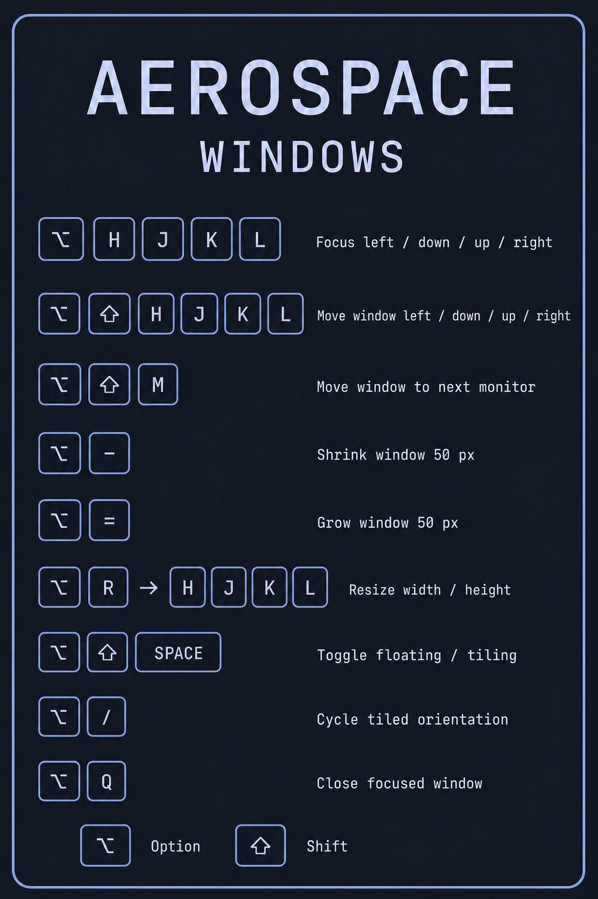
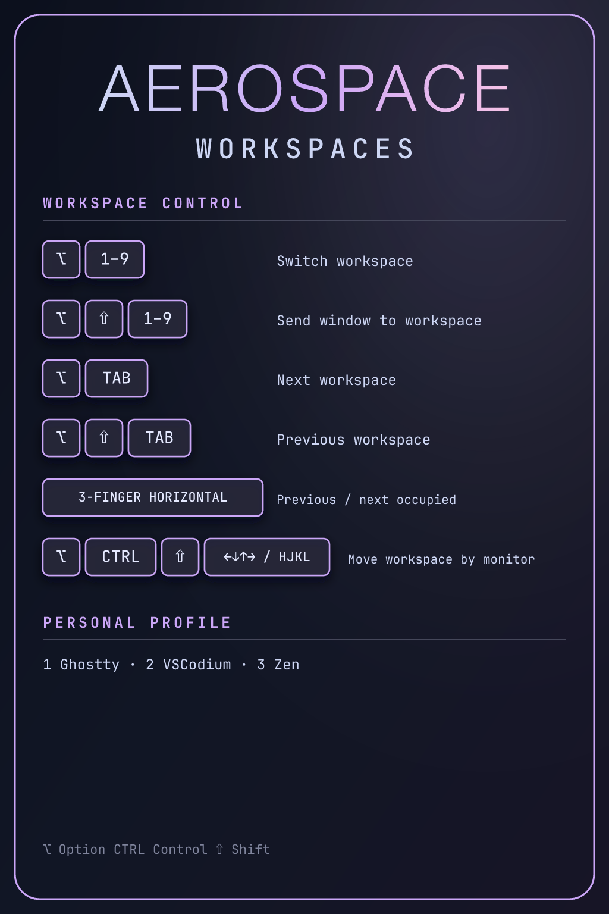

# AeroSpace workflow and keybinding cheat sheet


The AeroSpace config uses numbered workspaces, Omarchy-compatible arrow-key
navigation, optional Vim-style aliases, and fixed 8px gaps. A supervised
JankyBorders service provides focused-window highlighting. AeroSpace does not
start SketchyBar, dynamic gap scripts, or tmux.

The `alt` modifier in the AeroSpace config is the macOS **Option (⌥)** key.
Every modifier is written explicitly below; there is no implied `Mod` key.

### Automatic application workspaces

These assignments are part of the optional `personal` profile. Enable and
remember it with:

```bash
cd ~/Documents/dotfiles
./setup/bootstrap.sh --profile-personal
```

Fresh installations use the portable `default` profile, which does not assign
applications to workspaces. Return to it with `--profile-default`. Once selected,
the profile is preserved by ordinary bootstrap update runs.

With the personal profile active, every newly detected window from these
applications starts on a predictable home workspace:

| Application | Home workspace | Initial layout |
| --- | --- | --- |
| Ghostty | 1 | AeroSpace fullscreen |
| VSCodium | 2 | Tiled |
| Zen Browser | 3 | Tiled |

Additional windows use the same home workspace. AeroSpace applies these rules
only when it first detects a window, so moving a live window with
`Option (⌥) + Shift (⇧) + 1–9` is respected until that window closes.

Ghostty uses AeroSpace's fullscreen layout, which fills its virtual workspace
without creating another macOS Space. This is separate from
`Option (⌥) + F`, which toggles native macOS fullscreen.

AeroSpace routes windows but does not launch applications or save their session
contents. After login, macOS and each application remain responsible for
reopening their windows; any window they restore is routed to its home workspace
when AeroSpace detects it. Arbitrary manual workspace assignments are not saved
across a reboot.

### Trackpad gestures and Mission Control

[SwipeAeroSpace](https://github.com/MediosZ/SwipeAeroSpace) maps three-finger
horizontal swipes to AeroSpace workspace navigation on every managed setup. It
uses natural macOS direction, skips empty workspaces, and stops at the first or
last occupied workspace instead of wrapping around. AeroSpace starts the app
only while the gesture integration is enabled.

Native horizontal Space switching is disabled so macOS and SwipeAeroSpace do
not both react to the same gesture. The native three-finger vertical gesture is
also disabled, so swiping up does not open macOS Mission Control's unrelated
Spaces overview. SwipeAeroSpace's own swipe-up workspace overview is disabled
as well. Mission Control remains available through its keyboard key; the
managed setup enables **Group windows by application** as AeroSpace's documented
workaround when it is opened that way.

SwipeAeroSpace requires **System Settings → Privacy & Security → Accessibility**
permission. Inspect or recover the integration with:

```bash
cd ~/Documents/dotfiles
./scripts/trackpad-gestures.sh status
./scripts/trackpad-gestures.sh restore --dry-run
```

See the [setup guide](setup.md#trackpad-gesture-recovery) before running a real
restore.

### Main mode: focus and window movement

| Shortcut | Action |
| --- | --- |
| `Option (⌥) + Arrow` | Focus the window in that direction |
| `Option (⌥) + H/J/K/L` | Focus left/down/up/right (Vim aliases) |
| `Option (⌥) + Shift (⇧) + Arrow` | Move the focused window in that direction |
| `Option (⌥) + Shift (⇧) + H/J/K/L` | Move left/down/up/right (Vim aliases) |
| `Option (⌥) + Shift (⇧) + M` | Move the focused window to the next monitor and follow it |
| `Option (⌥) + -` | Shrink the focused window by 50 pixels |
| `Option (⌥) + =` | Grow the focused window by 50 pixels |

### Main mode: layouts and windows

| Shortcut | Action |
| --- | --- |
| `Option (⌥) + /` | Cycle tiled layout orientation |
| `Option (⌥) + ,` | Cycle accordion layout orientation |
| `Option (⌥) + T` | Toggle floating/tiling (Omarchy binding) |
| `Option (⌥) + Shift (⇧) + Space` | Toggle floating/tiling |
| `Option (⌥) + F` | Toggle native macOS fullscreen |
| `Option (⌥) + Q` | Close the focused window |
| `Option (⌥) + Enter (↩)` | Open Ghostty and start or attach Herdr |
| `Command (⌘) + H` | Disabled to prevent accidental application hiding |
| `Command (⌘) + Option (⌥) + H` | Disabled to prevent hiding other applications |

[Open the full-size AeroSpace window shortcut card](assets/aerospace-windows-shortcuts.png).

<a href="assets/aerospace-windows-shortcuts.png"></a>

`Option (⌥) + Shift (⇧) + M` targets physical monitors, not workspace
numbers. It cycles through every connected display with wrap-around and moves
focus with the window. This works when the visible workspaces on secondary
displays are named `10` and `11`; those names do not need dedicated number-key
bindings.

### Main mode: workspaces and monitors

| Shortcut | Action |
| --- | --- |
| `Option (⌥) + 1–9` | Switch to workspace 1–9 |
| `Option (⌥) + Shift (⇧) + 1–9` | Move the focused window to workspace 1–9 |
| `Option (⌥) + Tab (⇥)` | Switch to the next workspace |
| `Option (⌥) + Shift (⇧) + Tab (⇥)` | Switch to the previous workspace |
| `Option (⌥) + Control (⌃) + Tab (⇥)` | Return to the formerly focused workspace |
| `Option (⌥) + Control (⌃) + Shift (⇧) + Arrow or H/J/K/L` | Move the current workspace to the monitor in that direction |

[Open the full-size AeroSpace workspace shortcut card](assets/aerospace-workspaces-shortcuts.png).

<a href="assets/aerospace-workspaces-shortcuts.png"></a>

The directional workspace move carries the entire AeroSpace workspace tree,
including joined containers, to the other display. AeroSpace can create local
groups with `join-with` in service mode, but it cannot currently select and move
an arbitrary parent group by itself. Move the whole workspace when a joined
group must stay intact across monitors.

Finder, System Settings, and Calculator windows start floating. A Finder window
can still be tiled with `Option (⌥) + T`, moved normally, or minimized with the
standard macOS control.

### Resize mode

Enter resize mode with `Option (⌥) + R`. Keys within this mode do not use a
modifier unless one is shown.

| Shortcut | Action |
| --- | --- |
| `H` or `Left Arrow` | Reduce width by 50 pixels |
| `J` or `Down Arrow` | Increase height by 50 pixels |
| `K` or `Up Arrow` | Reduce height by 50 pixels |
| `L` or `Right Arrow` | Increase width by 50 pixels |
| `-` | Smart resize down by 50 pixels |
| `=` | Smart resize up by 50 pixels |
| `Enter (↩)` or `Escape (Esc)` | Return to main mode |

### Service mode

Enter service mode with `Option (⌥) + Shift (⇧) + Semicolon (;)`. Every listed
action automatically returns to main mode.

| Shortcut | Action |
| --- | --- |
| `Escape (Esc)` | Reload the AeroSpace config and return to main mode |
| `R` | Flatten/reset the current workspace tree |
| `F` | Toggle floating/tiling |
| `Backspace (⌫)` | Close every window in the workspace except the focused one |
| `Option (⌥) + Shift (⇧) + H/Left Arrow` | Join with the container to the left |
| `Option (⌥) + Shift (⇧) + J/Down Arrow` | Join with the container below |
| `Option (⌥) + Shift (⇧) + K/Up Arrow` | Join with the container above |
| `Option (⌥) + Shift (⇧) + L/Right Arrow` | Join with the container to the right |

The plain `Option (⌥) + H/J/K/L` shortcuts override Option-character entry on
the active US International keyboard layout while AeroSpace runs. The
Control-and-Shift workspace variants do not overlap an enabled macOS symbolic
shortcut on this machine.

### Focused-window highlighting

[JankyBorders](https://github.com/FelixKratz/JankyBorders) draws a rounded,
4-point Catppuccin Mocha Blue border around only the focused window. The blue
uses 80% opacity (`0xcc89b4fa`); inactive borders are transparent. Retina
rendering remains enabled, and no glow effect is used.

Homebrew runs `borders` as a per-user login service with launchd `KeepAlive`.
It starts independently of AeroSpace and is automatically relaunched after an
unexpected exit. Its appearance is managed from `~/.config/borders/bordersrc`.
To apply appearance changes without restarting the service:

```bash
~/.config/borders/bordersrc
```

JankyBorders does not require Accessibility permission. Manage and inspect the
service from the repository:

```bash
cd ~/Documents/dotfiles
./scripts/borders-service.sh status
./scripts/borders-service.sh restart
```

Homebrew records service output in `$(brew --prefix)/var/log/borders/`. If
status fails, inspect `borders.out.log` and `borders.err.log` there.

### Validate and reload

```bash
aerospace reload-config --dry-run --warnings-as-errors
aerospace reload-config
```

### Remove focused-window highlighting

The checkpoint tag `aerospace-pre-jankyborders-20260810` marks the repository
before JankyBorders was added. To stop highlighting without changing the
repository:

```bash
cd ~/Documents/dotfiles
./scripts/borders-service.sh disable
stow --delete --target="$HOME" borders
```

To prepare a complete repository rollback, restore the changed managed files
from the checkpoint, remove the new Stow package, and optionally uninstall the
formula:

```bash
cd ~/Documents/dotfiles
git restore --source=aerospace-pre-jankyborders-20260810 -- \
  Brewfile README.md aerospace/.aerospace.toml setup/bootstrap.sh \
  docs/aerospace.md docs/index.md docs/setup.md
git rm -r borders scripts/borders-service.sh
brew services stop borders
brew uninstall borders
```

Only run `brew untap FelixKratz/formulae` if no other installed formula uses
that tap.

### Restore the pre-Omachy configuration

The repository checkpoint `aerospace-pre-omachy-20260810` contains the exact
known-good configuration from before the Omachy-inspired workflow was added.

```bash
cd ~/Documents/dotfiles
git restore --source=aerospace-pre-omachy-20260810 -- aerospace/.aerospace.toml
aerospace reload-config --dry-run --warnings-as-errors
aerospace reload-config
```

To recover the current committed config after rehearsing a restore:

```bash
git restore aerospace/.aerospace.toml
aerospace reload-config --dry-run --warnings-as-errors
aerospace reload-config
```
