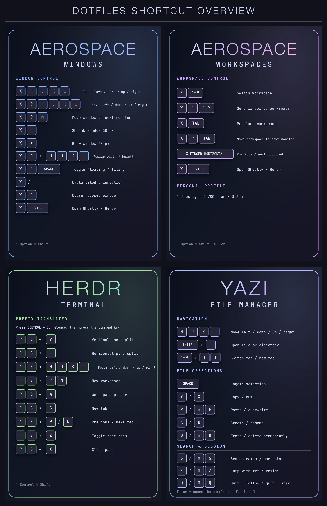

# Pabu's dotfiles

These guides document one-command installation, safe updates, keyboard
ownership, and recovery for the dotfiles in this repository.

## Guides

- [Bootstrap, updates, and Stow usage](setup.html)
- [AeroSpace workflow and keybindings](aerospace.html)
- [Ghostty and Herdr keybindings](terminal.html)
- [Menu-bar icon management](menubar.html)

## Keyboard ownership

| Layer | Owner |
| --- | --- |
| macOS windows and workspaces | AeroSpace |
| Three-finger horizontal workspace swipes | SwipeAeroSpace |
| Focused-window outline | JankyBorders, supervised by a Homebrew login service |
| Native menu-bar icon visibility | Selected Hidden Bar or Ice provider |
| Terminal workspaces, tabs, panes, navigation, zoom, and resize | Herdr |
| Clipboard, search, font size, terminal windows, and fullscreen | Ghostty |

Every cheat sheet uses explicit macOS modifier names. There is no implied or
unexplained `Mod` key.

## Visual shortcut cards

[Open the complete dotfiles shortcut overview](assets/dotfiles-shortcuts-overview.png).

The individual cards remain available beside the relevant written guides:

- [AeroSpace window shortcuts](assets/aerospace-windows-shortcuts.png)
- [AeroSpace workspace shortcuts](assets/aerospace-workspaces-shortcuts.png)
- [Herdr terminal shortcuts](assets/herdr-terminal-shortcuts.png)
- [Yazi file-manager shortcuts](assets/yazi-shortcuts.png)
