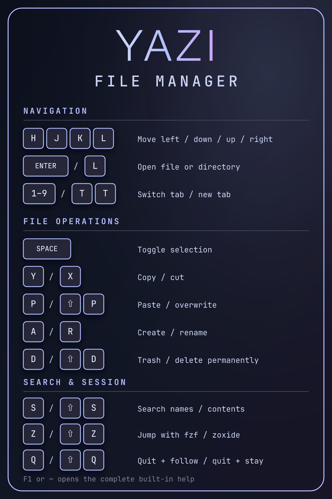
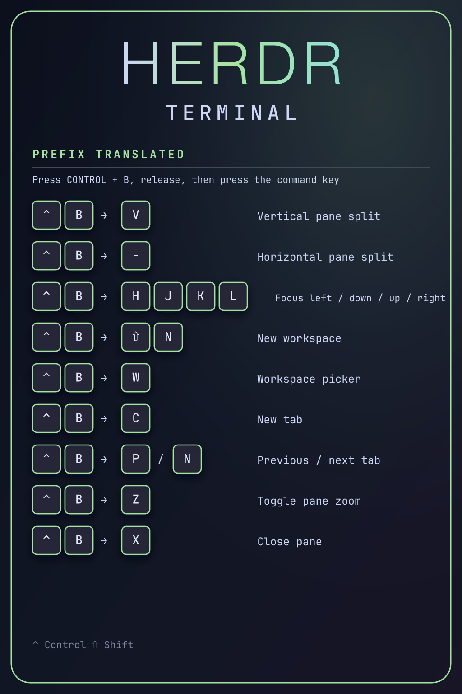

# Ghostty, Herdr, and Yazi

Herdr is the primary terminal workspace layer. It owns workspaces, tabs, panes,
navigation, splits, zoom, resize mode, and its sidebar. Ghostty owns only
terminal-host functions that Herdr cannot provide.

## Yazi file manager

Yazi is installed with its media, archive, document, search, and navigation
helpers. Its managed configuration shows hidden files and adds a coordinated
theme while inheriting the remaining upstream defaults:

```text
yazi/
└── .config/
    └── yazi/
        ├── theme.toml
        └── yazi.toml
```

This maps to `~/.config/yazi/`. The theme uses the same Catppuccin Mocha palette
and lavender-to-surface status pills as Starship while retaining Yazi's built-in
file-type icon colors. Start Yazi with `y`; after navigating, quit with `q` to
adopt Yazi's final directory in the parent shell. Quit with `Q` when the shell
should remain in its original directory. The `yazi` command remains available
for direct use without directory adoption.

[Open the full-size Yazi shortcut card](assets/yazi-shortcuts.png).

<a href="assets/yazi-shortcuts.png"></a>

### Essential Yazi keys

| Key | Action |
| --- | --- |
| `H/J/K/L` or arrow keys | Move left/down/up/right |
| `Enter` or `L` | Open the selected file or directory |
| `1–9` | Switch to tab 1–9 |
| `T`, then `T` | Create a new tab |
| `Space` | Toggle selection |
| `Y` / `X` | Copy / cut selected files |
| `P` / `Shift (⇧) + P` | Paste / paste and overwrite |
| `A` / `R` | Create / rename |
| `D` / `Shift (⇧) + D` | Move to Trash / delete permanently |
| `S` / `Shift (⇧) + S` | Search names with `fd` / contents with `ripgrep` |
| `Z` / `Shift (⇧) + Z` | Jump with `fzf` / `zoxide` |
| `Q` / `Shift (⇧) + Q` | Quit and adopt Yazi's directory / quit without changing directory |
| `F1` or `~` | Open the complete built-in help |

`ffmpeg-full` and `imagemagick-full` are keg-only Homebrew formulae. The managed
Zsh setup adds their `bin` directories to `PATH` when installed instead of
force-linking them over regular Homebrew variants.

## Herdr Stow package

```text
herdr/
└── .config/
    └── herdr/
        └── config.toml
```

This maps to `~/.config/herdr/config.toml` while leaving Herdr's logs, sockets,
and session state untouched.

Install or update the managed link through the repository's single setup entry
point, then reload Herdr:

```bash
cd ~/Documents/dotfiles
./setup/bootstrap.sh --no-repo-update
herdr server reload-config
```

## How the Herdr prefix works

Press `Control (⌃) + B`, release both keys, and then press the command key shown
below. A shortcut written as `Control (⌃) + B`, then `Shift (⇧) + N` is a
sequence, not one simultaneous chord.

The portrait card translates the prefix on every row instead of using an
abstract `PREFIX` key: `[⌃] [B] → [command key]`.

[Open the full-size Herdr terminal shortcut card](assets/herdr-terminal-shortcuts.png).

<a href="assets/herdr-terminal-shortcuts.png"></a>

### General and workspace commands

| Prefix sequence | Action |
| --- | --- |
| `Control (⌃) + B`, then `?` | Open help |
| `Control (⌃) + B`, then `S` | Open settings |
| `Control (⌃) + B`, then `Q` | Detach from the session |
| `Control (⌃) + B`, then `Shift (⇧) + R` | Reload the Herdr config |
| `Control (⌃) + B`, then `O` | Open the notification target |
| `Control (⌃) + B`, then `W` | Open the workspace picker |
| `Control (⌃) + B`, then `G` | Open goto mode |
| `Control (⌃) + B`, then `Shift (⇧) + N` | Create a workspace |
| `Control (⌃) + B`, then `Shift (⇧) + G` | Create a worktree |
| `Control (⌃) + B`, then `Shift (⇧) + W` | Rename the workspace |
| `Control (⌃) + B`, then `Shift (⇧) + D` | Close the workspace |

### Tab commands

| Prefix sequence | Action |
| --- | --- |
| `Control (⌃) + B`, then `C` | Create a tab |
| `Control (⌃) + B`, then `Shift (⇧) + T` | Rename the tab |
| `Control (⌃) + B`, then `P` | Select the previous tab |
| `Control (⌃) + B`, then `N` | Select the next tab |
| `Control (⌃) + B`, then `1–9` | Select tab 1–9 |
| `Control (⌃) + B`, then `Shift (⇧) + X` | Close the tab |

### Pane commands

| Prefix sequence | Action |
| --- | --- |
| `Control (⌃) + B`, then `H/J/K/L` | Focus left/down/up/right |
| `Control (⌃) + B`, then `Tab (⇥)` | Cycle to the next pane |
| `Control (⌃) + B`, then `Shift (⇧) + Tab (⇥)` | Cycle to the previous pane |
| `Control (⌃) + B`, then `V` | Create a vertical split |
| `Control (⌃) + B`, then `-` | Create a horizontal split |
| `Control (⌃) + B`, then `X` | Close the pane |
| `Control (⌃) + B`, then `Z` | Toggle pane zoom |
| `Control (⌃) + B`, then `R` | Enter resize mode |
| `Control (⌃) + B`, then `Shift (⇧) + P` | Rename the pane |
| `Control (⌃) + B`, then `E` | Edit pane scrollback |
| `Control (⌃) + B`, then `B` | Toggle the sidebar |

Navigate mode uses the arrow keys for workspaces and `H/J/K/L` for panes. In a
remote Herdr client, `Control (⌃) + V` performs remote image paste.

## Ghostty and the AeroSpace modifier

Ghostty normally reserves Option for rectangular mouse selection on macOS and
shows a crosshair while it is held. The managed config remaps physical Left
Option to Control inside Ghostty before that mouse-selection check. AeroSpace
still receives Left Option as its window-management modifier because the remap
is local to Ghostty.

Use Left Option for AeroSpace shortcuts. Right Option retains normal Option
input and rectangular selection inside Ghostty. If AeroSpace does not claim a
Left Option shortcut, Ghostty sends it to the terminal as a Control shortcut.
The side-specific `key-remap` setting requires Ghostty 1.3.0 or newer.

## Ghostty shortcuts retained

Ghostty starts its keybinding section with `keybind = clear`. Any shortcut not
listed here is passed to Herdr or the focused pane application.

| Shortcut | Action |
| --- | --- |
| `Command (⌘) + C` | Copy |
| `Command (⌘) + V` | Paste |
| `Command (⌘) + +` or `Command (⌘) + =` | Increase font size |
| `Command (⌘) + -` | Decrease font size |
| `Command (⌘) + 0` | Reset font size |
| `Command (⌘) + F` | Start search |
| `Command (⌘) + E` | Search selected text |
| `Command (⌘) + G` | Next search result |
| `Command (⌘) + Shift (⇧) + G` | Previous search result |
| `Command (⌘) + Shift (⇧) + F` or `Escape (Esc)` | End search |
| `Command (⌘) + N` | Open a new Ghostty window |
| `Command (⌘) + Enter (↩)` | Toggle Ghostty fullscreen |
| `Command (⌘) + Q` | Quit Ghostty |
| `Command (⌘) + ,` | Open the Ghostty config |
| `Command (⌘) + Shift (⇧) + ,` | Reload the Ghostty config |

Ghostty does not own tabs, splits, surface navigation, split zoom/resize,
scrolling, prompt navigation, or numbered tab switching.

## Validate

```bash
/Applications/Ghostty.app/Contents/MacOS/ghostty +validate-config \
  --config-file=~/Documents/dotfiles/ghostty/.config/ghostty/config.ghostty
/Applications/Ghostty.app/Contents/MacOS/ghostty +list-keybinds
herdr config check
herdr server reload-config
```

## Recovery

The repository tag `terminal-pre-herdr-keymap-20260810` marks the known-good
state before keybinding ownership changed.

Restore Ghostty's earlier configuration:

```bash
cd ~/Documents/dotfiles
git restore --source=terminal-pre-herdr-keymap-20260810 -- \
  ghostty/.config/ghostty/config.ghostty
/Applications/Ghostty.app/Contents/MacOS/ghostty +validate-config \
  --config-file=ghostty/.config/ghostty/config.ghostty
```

Return Herdr to its built-in defaults by removing only its Stow link:

```bash
cd ~/Documents/dotfiles
stow --delete --target="$HOME" herdr
herdr server reload-config
```

The built-in defaults are provided by Herdr itself and are not duplicated in
this repository.
